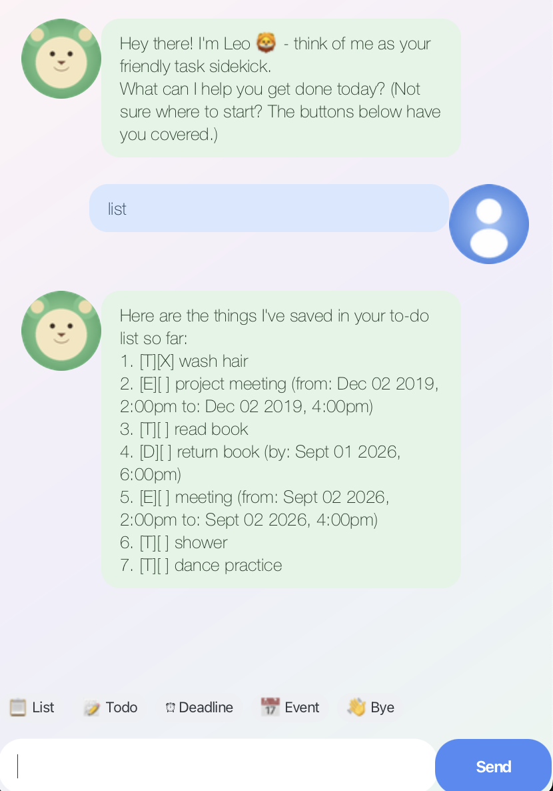

# Leo User Guide

Leo is a friendly desktop chatbot that helps you track your tasks — todos, deadlines, and events — through simple typed commands. It keeps your list saved between sessions, so you never have to re-enter anything.

## Quick start

1. Ensure you have Java 17 or above installed on your computer.
2. Download the latest `leo.jar` from the [Releases](../../releases) page.
3. Copy the file to the folder you want to use as the home folder for Leo.
4. Open a terminal in that folder and run `java -jar leo.jar`.
5. Type a command into the box at the bottom of the window and press Enter, or click one of the quick-action buttons above it, to get started.

## Adding todos

Adds a simple task with no date attached.

Example: `todo borrow book`

## Adding deadlines

Adds a task that needs to be done by a specific date and time.

Example: `deadline return book /by 2026-09-20 1800`

The date and time must be entered in `yyyy-MM-dd HHmm` format (e.g. `2026-09-20 1800` for 20 Sep 2026, 6:00pm).

## Adding events

Adds a task that spans a start and end time.

Example: `event project meeting /from 2026-09-21 1400 /to 2026-09-21 1600`

Like deadlines, both times must be in `yyyy-MM-dd HHmm` format.

## Listing all tasks

Shows every task currently in your list, numbered in the order they were added.

Example: `list`

## Marking a task as done

Marks the given task number as completed.

Example: `mark 1`

## Unmarking a task

Marks the given task number as not yet completed.

Example: `unmark 1`

## Deleting a task

Removes the given task number from your list.

Example: `delete 2`

## Finding tasks

Finds and lists all tasks whose description contains the given keyword.

Example: `find book`

## Exiting the app

Says goodbye and closes the window shortly after.

Example: `bye`

## Command summary

| Action | Format | Example |
|---|---|---|
| Todo | `todo DESCRIPTION` | `todo borrow book` |
| Deadline | `deadline DESCRIPTION /by yyyy-MM-dd HHmm` | `deadline return book /by 2026-09-20 1800` |
| Event | `event DESCRIPTION /from yyyy-MM-dd HHmm /to yyyy-MM-dd HHmm` | `event project meeting /from 2026-09-21 1400 /to 2026-09-21 1600` |
| List | `list` | `list` |
| Mark | `mark INDEX` | `mark 1` |
| Unmark | `unmark INDEX` | `unmark 1` |
| Delete | `delete INDEX` | `delete 2` |
| Find | `find KEYWORD` | `find book` |
| Exit | `bye` | `bye` |
